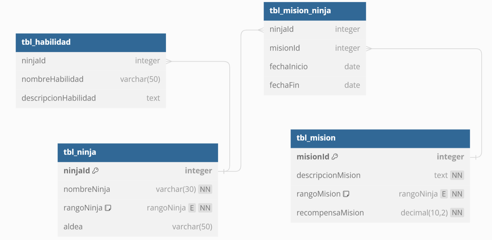
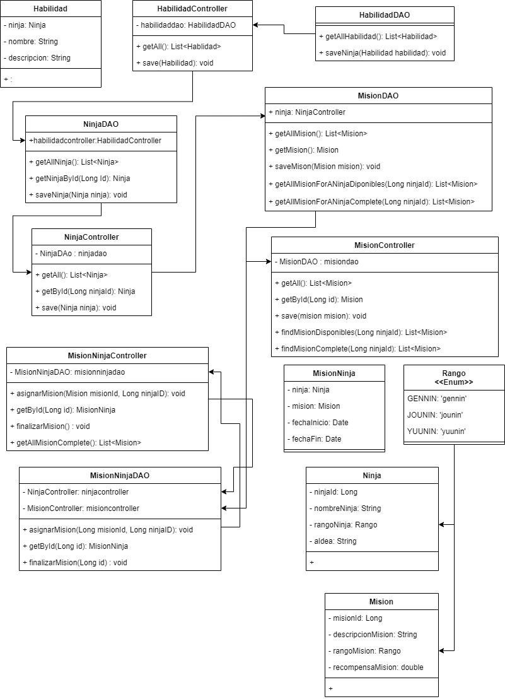

# 
# Naruto System Mision

This is a mission management system for the village hidden in the leaves, this system manages only the missions, and the shinobi that are assigned to them with their date in addition to the shinobi's skills.

## BD Model

## UML diagram of the system

## Author

- [@johanp0308](https://github.com/johanp0308)

